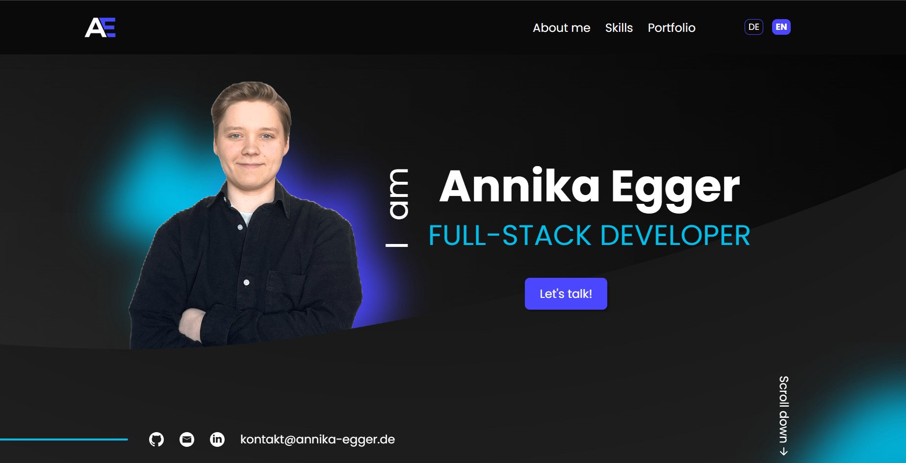

# 💼 Personal Portfolio

My personal portfolio website to showcase my projects, skills and provide an easy way to get in touch.



## Quick Start

- Clone the repository:

```bash
git clone https://github.com/AnnikaEgger/portfolio.git
cd portfolio
```

- Open index.html in your browser.
- Note: The contact form requires a PHP server environment to work. Opening the files directly in your browser will not execute the PHP script.

## ✨ Features

- 🌍 **Multilingual** – Switch between English and German without reloading the page.
- 📱 **Responsive Design** – Optimized for desktop, tablet, and mobile devices.
- 📬 **PHP Contact Form** – Validates user input and sends messages directly to my inbox.

## 🛠 Tech Stack

- HTML5
- CSS3
- JavaScript (ES6)
- PHP

## 📁 Project Structure

```text
├── assets
│   ├── fonts
│   ├── icons
│   └── img
├── scripts
│   └── ...
├── styles
│   └── ...
├── contact-form-mail.php
├── index.html
├── legal-notice.html
├── privacy-policy.html
├── README.md
├── script.js
└── style.css
```

<!-- ## 📬 Contact

If you'd like to get in touch, feel free to use the contact form on the website or connect with me on LinkedIn. -->
